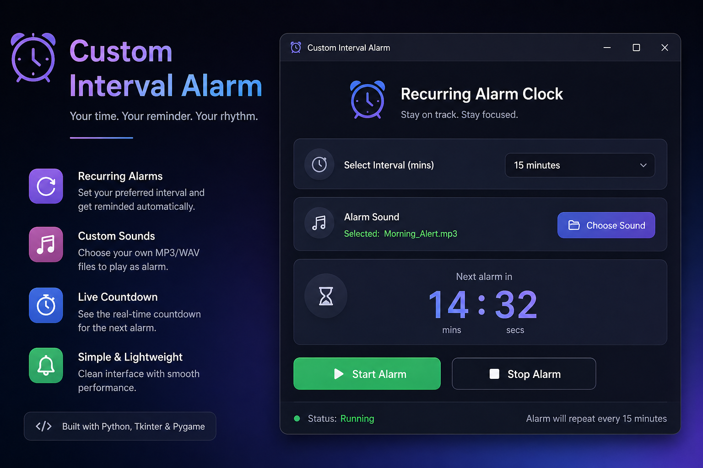

<p align="center">
  


# ⏰ Custom Interval Alarm

I built this small app to solve a simple problem — sometimes you just need a reminder that repeats, not a one-time alarm.

This is a lightweight desktop app where you can set a time interval, and it will keep reminding you until you stop it. It’s useful for studying, taking breaks, or building consistent habits.

---

## ✨ What it does

* Set a repeating alarm (every 5, 10, 15 minutes, etc.)
* See a live countdown timer
* Use your own alarm sound (MP3/WAV)
* Default beep if no sound is selected
* Simple and clean interface

---

## 🛠 Built with

* Python
* Tkinter (GUI)
* Pygame (audio playback)
* Threading (for smooth performance)

---

## 🚀 Getting started

Clone the repository:

```bash
git clone https://github.com/your-username/custom-interval-alarm.git
cd custom-interval-alarm
```

Run the app:

```bash
python3 reminder-alert-2.0.py
```

> The script will try to install missing dependencies automatically if needed.

---

## 🧑‍💻 How to use

1. Select your desired time interval
2. (Optional) Choose a custom sound
3. Click **Start Alarm**
4. Let it run in the background

When the time is up:

* The alarm sound will play
* A popup will appear

Click **OK** to stop the alarm and restart the cycle.

---

## 💡 Why I made this

Most reminder apps are either too complex or don’t support simple repeating intervals the way I wanted.
So I made something minimal, fast, and actually useful.

---

## ⚠️ Notes

* If no sound is selected, Windows uses a basic beep
* On macOS/Linux, it's better to choose a sound file
* Make sure Python is properly installed on your system

---

## 🔧 Future improvements

* Custom time input (instead of fixed options)
* Multiple alarms
* Dark mode
* Saving user preferences

---

## 🤝 Contributing

Feel free to fork the project and improve it. Pull requests are welcome!

---

## 📄 License

This project is open-source and available under the MIT License.

---

## 👤 Author

Made by **Mahi Mostafa**

---
